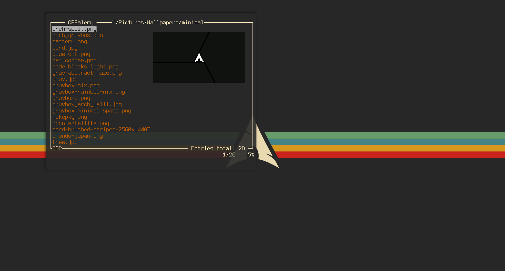

# CPPalery
A file browsing and wallpaper setting ncurses-based TUI application. It allows users to navigate through directories, preview images, and set  the chosen images as wallpapers, as well as set a random wallpaper.



## Usage
```
Usage: cppalery [option]

Options:
-h          Print help message to the terminal
-c          Set path to load config file
<path>      Set starting workpath
```
Press <kbd>?</kbd> in the app to display the list of keybindings.

## Dependencies
* ncurses library
* Ueberzug (optional)
* Wallpaper setting CLI program of your choosing

Currently the app uses Ueberzug to display image previews in the terminal (optional). You can disable this feature in config file. The app can use the wallpaper setting backend, specified in the config file, to actually set the wallpaper.

## Configuration
The configuration file is located at $HOME/.config/cppalery/config. Comments start with `#` char.

| Keyword                   | Possible values| Description                                  |
| --------------------------| ---------------|----------------------------------------------|
| workpath                  | "path"         | Initial directory to browse.                 |
| relative_path             | true/false     | Display relative path.                       |
| sort_name_ascending       | true/false     | Sort directory contents by name ascending.   |
| preview                   | true/false     | Enable image previews.                       |
| wallpaper_set_fill        | "command"      | Command to set wallpaper with fill option.   |
| wallpaper_set_center      | "command"      | Command to set wallpaper with center option. |

## Installation
Specify cmake options of your preference, such as
```
cmake -DCMAKE_INSTALL_PREFIX=/usr
cmake -CMAKE_INSTALL_MANDIR=/usr/share/man
```
Then you can build the program with cmake, for example
```
cmake -S . -B build/
cmake --build build/
```
Finally, you can install the program to the previously specified directories
```
sudo cmake --install build/
```
